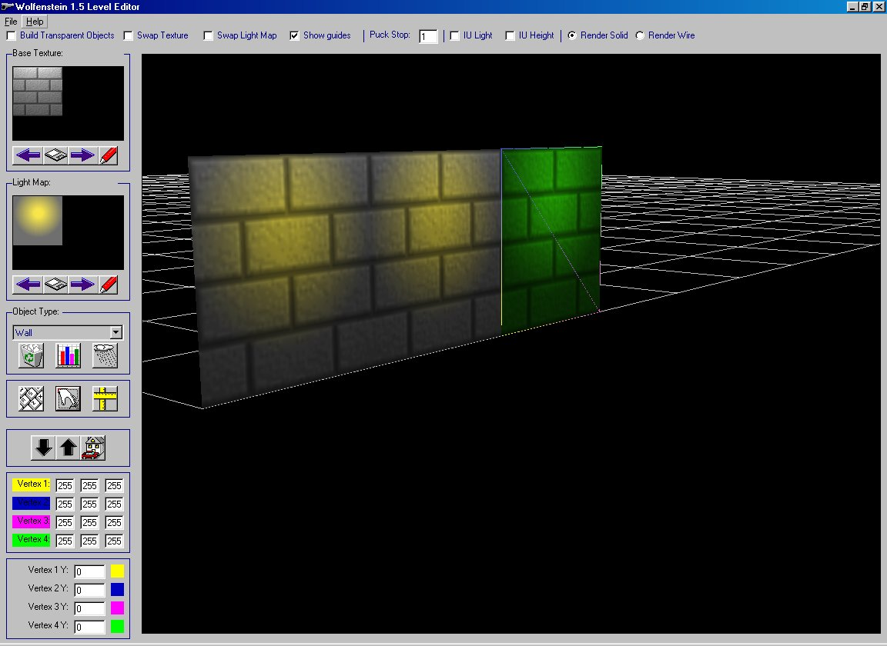



## Wolfenstein Engine Rebuild Level Editor

### Description

This code is a completed Level Designing Application. It was built to work with a replacement Windows engine for Wolfenstein3D (the original 1991 version!). It features Lightmapping,vertice lighting, filtering and the ability to create you own gloriously rendered Wolfenstein style levels.
 
### More Info
 
See the instructions.txt in the zip file for detailed info on product operation.

A good knowledge of DirectX8 and Visual Basic is need to understand the source code.

There may be bugs and several adavanced functions are not yet in place. These are explained in the instructions.

             |
---                |---
**Submitted On**   |2002-05-18 13:04:14
**By**             |[Timothy Paling](https://github.com/Planet-Source-Code/PSCIndex/blob/master/ByAuthor/timothy-paling.md)
**Level**          |Advanced
**User Rating**    |4.9 (44 globes from 9 users)
**Compatibility**  |VB 5\.0, VB 6\.0
**Category**       |[DirectX](https://github.com/Planet-Source-Code/PSCIndex/blob/master/ByCategory/directx__1-44.md)
**World**          |[Visual Basic](https://github.com/Planet-Source-Code/PSCIndex/blob/master/ByWorld/visual-basic.md)
**Archive File**   |[Wolfenstei845285182002\.zip](https://github.com/Planet-Source-Code/timothy-paling-wolfenstein-engine-rebuild-level-editor__1-34906/archive/master.zip)

